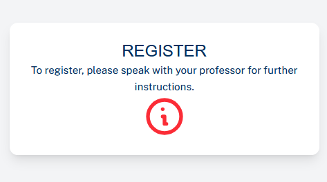
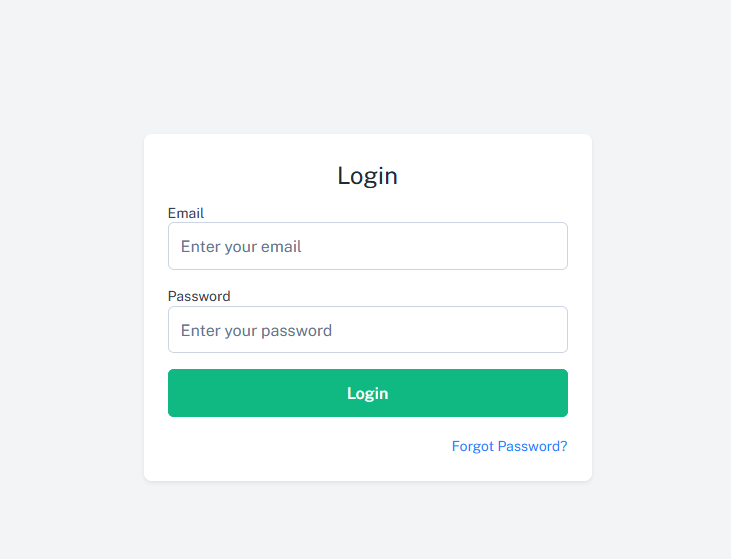
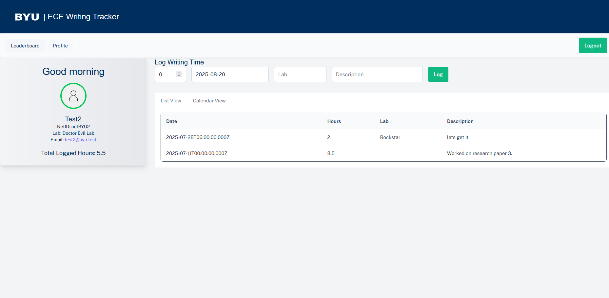
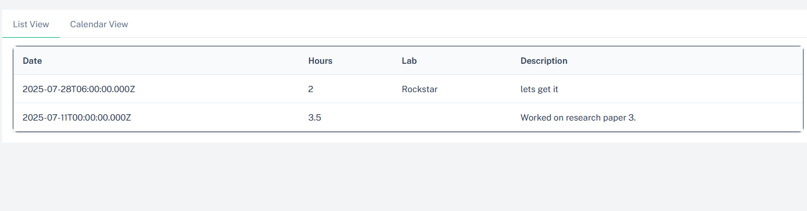

# User Guide

## Overview
This app helps writers track their writing sessions. Writers can log sessions, view their history, and track progress over time.

## Getting Started

### 1. Getting Access
- Registration is handled by professors/admins.  
- Contact your professor if you need an account.  

### 2. Logging a Writing Session
1. Login into App

2. Navigate to Profile (If you cant see Profile tab refresh page)

3. Enter:
   - Hours
   - Date
   - Lab
   - Description (Notes)
3. Click **Log**.

### 3. Viewing Your History
- Go to **Profile** to see all your sessions.
- Select either List View

### 4. Managing Your Profile
- Go to **Profile** to view or update your information.

*(Screenshots can be added later for clarity.)*
